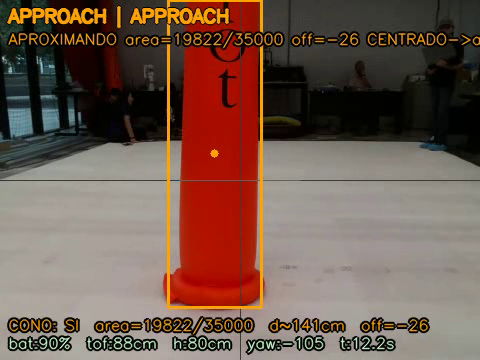
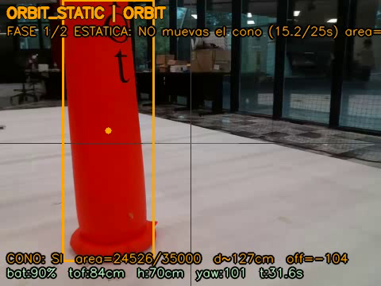
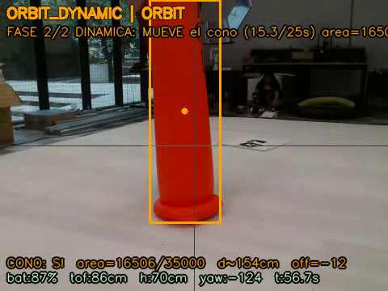
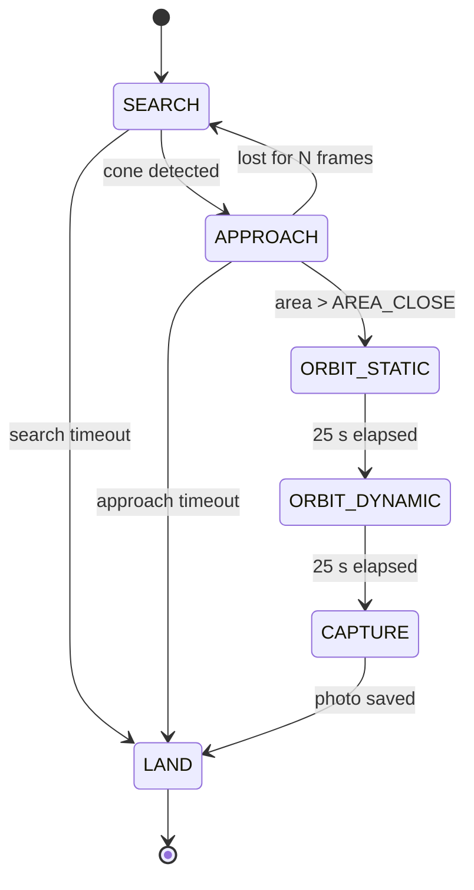
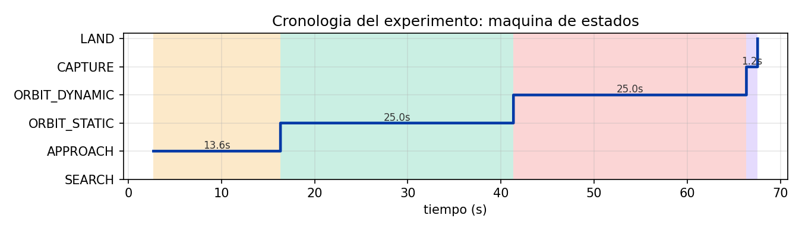
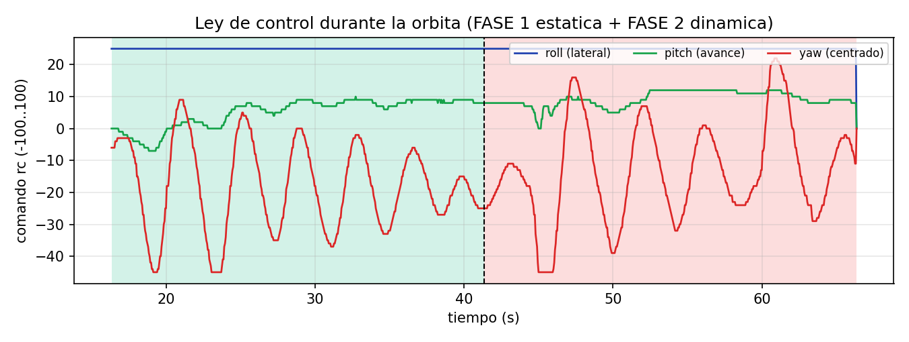
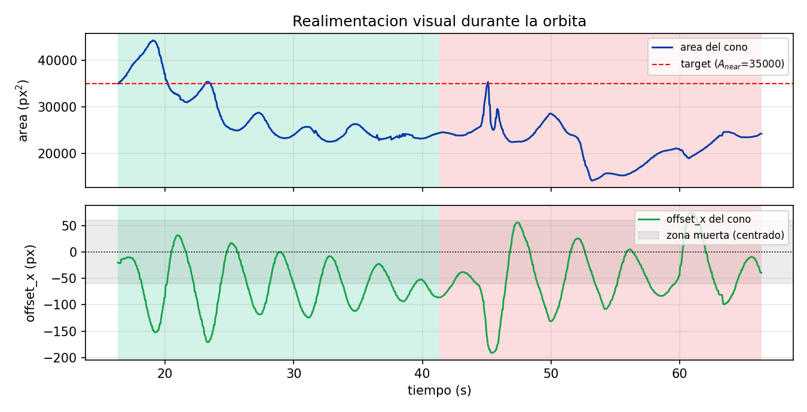
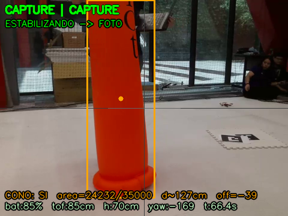

# Lab 05: Final Project, Autonomous Inspector

Dynamic image based visual servoing on a DJI Tello. The drone searches
for an orange cone, approaches it, orbits around it in two
back-to-back phases (one with the cone fixed, one where the operator
moves the cone), takes a photograph of the inspected target, and
lands.

Approved flight: 2026-06-03.

## Demo

[](https://youtu.be/uXXDjiPWrlk)

| Phase | Frame from the HUD |
|---|---|
| APPROACH |  |
| ORBIT_STATIC |  |
| ORBIT_DYNAMIC |  |

> The HUD overlay text in these frames is in Spanish because the
> archive comes from the original approved flight. The committed
> source code is in English; re-running `inspector_mission.py` will
> render the HUD with the English labels.

## What the mission does

State machine:



| Phase | Goal | Exit condition |
|---|---|---|
| SEARCH | Rotate in place at constant yaw rate until the cone enters the frame. | Cone detected, area > threshold |
| APPROACH | PD on yaw with a deadband; advance only while centered. | Apparent cone area > `AREA_CLOSE` |
| ORBIT_STATIC | Constant lateral roll, PD on yaw (centering), P on pitch (hold distance from area). | 25 s elapsed |
| ORBIT_DYNAMIC | Same control law; operator moves the cone during this phase. | 25 s elapsed |
| CAPTURE | Hover briefly, save the current HUD frame as the inspection photo. | 1.2 s elapsed |
| LAND | Send `land`. | Drone confirms landing |

The two orbit phases share `_orbit_control()` and the same gains. The
split exists only to make the experiment a controlled comparison: in
the first phase the target is fixed and the orbit closes on a clean
ellipse around it; in the second phase the operator introduces a
perturbation by moving the cone and the planner tracks it.

## Control law during the orbit

```
yaw      = clip(Kp_yaw * offset_x,                       -clamp_yaw,   +clamp_yaw)
pitch    = clip(Kp_pitch * (AREA_TARGET - area),         -clamp_pitch, +clamp_pitch)
roll     = ROLL_CONST   (constant lateral push)
throttle = 0
```

`offset_x` is `cx - FRAME_WIDTH/2` of the detected cone centroid; the
sign of `yaw` makes the drone rotate towards the cone. `pitch` uses the
area error so that when the cone gets smaller (drone too far) it
advances and when it gets larger (drone too close) it retreats. The
lateral roll keeps the drone moving sideways, so the combined motion
draws an arc around the target.

## Files

| File | Purpose |
|---|---|
| `inspector_mission.py` | Entry point. Implements the planner, the HUD overlay, the CSV log and the executor loop at 20 Hz. |
| `tello_driver.py` | UDP driver for the Tello: command socket (8889), telemetry push reader (8890), threaded video reader (11111). |
| `vision.py` | HSV based cone detector and distance estimation from apparent area. |
| `config.py` | All tunable constants (HSV bounds, gains, durations, distance reference). |
| `preflight.py` | Pre-flight check. Verifies SDK, battery, telemetry, video and current cone visibility. Does not take off. |
| `calibrate.py` | Headless HSV / focal calibration utility. |
| `analyze.py` | Renders the report figures from the CSV log and extracts one HUD frame per phase from the recorded mp4. |

## How to run

```
# Connect to the Tello WiFi first (TELLO-XXXXXX).

python3 preflight.py            # checks, does NOT take off
python3 inspector_mission.py    # full mission with live HUD
python3 analyze.py              # figures from the most recent flight
```

During flight: press `q` to land cleanly, press `e` for emergency stop.

## Calibration

Lighting changes, so the HSV bounds should be re-measured before
flying. The fastest path is:

```
# Hold the cone in the centre of the frame for a few seconds:
python3 calibrate.py --mode hsv --source tello

# Then verify with preflight:
python3 preflight.py
```

`calibrate.py --mode focal --dist 100` is only needed if you want the
pinhole distance estimate. The mission itself uses the area based
estimate, which only needs `DIST_REF_CM` and `AREA_REF` in `config.py`
(both bench measured).

## Distance from apparent area

The mission does not need a calibrated focal length. Apparent area
scales as the inverse square of distance, so:

```
d = DIST_REF_CM * sqrt(AREA_REF / area)
```

`DIST_REF_CM` and `AREA_REF` were measured on the bench with a tape
measure. This is robust to camera intrinsics drift and to the fact
that the cone is not exactly a planar object.

## Outputs

Every run writes timestamped artefacts to `evidence/`:

```
inspector_mission_YYYYMMDD_HHMMSS.mp4   # HUD video
telemetry_inspector_YYYYMMDD_HHMMSS.csv # 15 column log at ~20 Hz
inspection_YYYYMMDD_HHMMSS.png          # frame captured in CAPTURE
```

`analyze.py` reads the most recent CSV and writes the figures into
`figures/`.

## Results from the approved flight

The plots below come from the CSV log of the 2026-06-03 flight that the
professor approved.

### Mission timeline



Each band is one phase; the duration of every band is annotated. The
two orbit phases ran for the full 25 s as designed.

### Control law during the orbit



`roll` is held at a constant lateral push, `pitch` follows the area
error (advances when the cone shrinks, retreats when it grows), `yaw`
keeps the cone centred. The dashed black line marks the moment the
operator started moving the cone for phase 2.

### Visual feedback during the orbit



Top: target area against the desired set-point of 35 000 px². Bottom:
horizontal offset of the cone centroid; the grey band is the deadband
where yaw stays at zero.

### Inspection artefact

The mission saves one frame as the inspection photo when entering the
CAPTURE phase.



## Safety

The mission refuses to take off below 25% battery, runs a 120 s
watchdog and lands cleanly on `q`. There is no obstacle avoidance
beyond the cone itself: keep at least 2 m of clear space around the
orbit radius and an observer ready to catch the drone if the radio
link drops.
